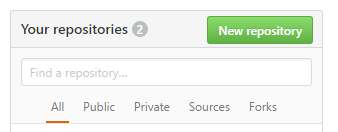
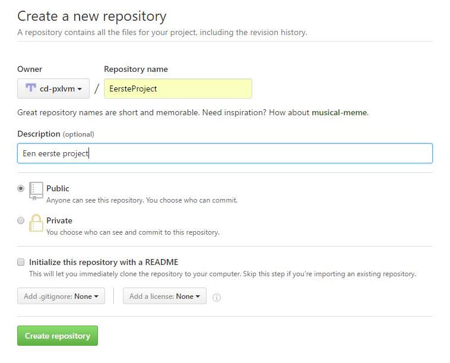
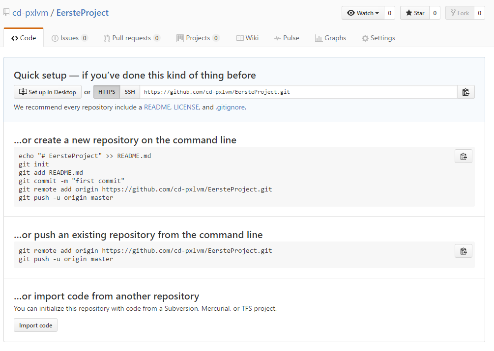
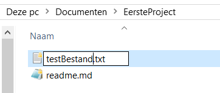
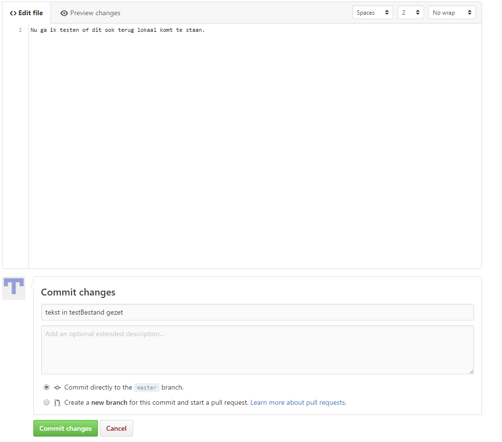
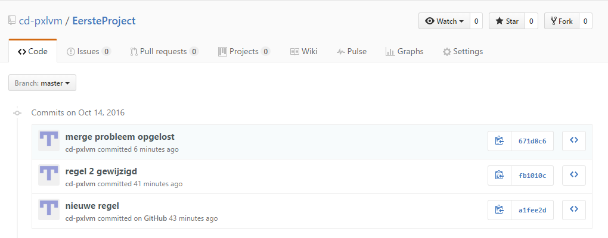


# Werken in Git in PowerShell
Auteur: Carine Derkoningen  
Ondersteuning: Kris Hermans  
Nagelezen door: Carina Medats  
Aangepast door: Sam Vanderstraeten en Carine Derkoningen

## Introductie  

We gaan eerst lokaal leren werken met Git, om dan ons project in GitHub te plaatsen. Voorlopig gaan we ook enkel met de masterbranch werken. Als je later GitHub gaat gebruiken om je code project in onder te brengen is het beter dat je met meerdere branchs gaat werken.  
Een goede afspraak is dat de masterbranch je ‘clean’ code is: hier staat geteste code, die zo in productie gebruikt kan worden. (Weet wel dat Git je daarin vrij laat, je kan hier ook andere afspraken maken) Elke andere branch geef je een naam, zodat je altijd weet in welke branch je aan het werken bent.  
In Git is het begin van een branch altijd een verwijzing (pointer)  naar de versie van dat moment in de branch van waaruit je vertrekt.  
Je kan een branch zien als een kopie van de masterbranch op dat moment. Hier kan je dan in gaan werken en dit kan je dan op een gegeven moment weer gaan samenvoegen (= merge).  
Later gaan we hier iets dieper op in, maar wil je dit al eens bekijken, vind je dit visueel voorgesteld op: [GitHub flow](https://guides.github.com/introduction/flow/).  
Personaliseer deze cursus: voeg waar (plaats afbeelding) staat een screenshot toe van je terminal met het commando en het resultaat zichtbaar.

Commandline: heel simpel: alle commando’s die te maken hebben met Git beginnen ook met git en dan een spatie. Let dus op als je git gebruikt in PowerShell, er zijn geen typische PowerShell commands voorzien voor git. Als je niet meer weet wat een commando juist doet, kan je altijd volgende commando typen:
 ```>git help [commandonaam]``` 

Een laatste opmerking voor we beginnen, als je Git for Windows geïnstalleerd hebt, zijn de Git commando's die we behandelen beschikbaar in alle Command Line Interfaces in Windows, dus zowel in PowerShell als in de traditionele Command Prompt.
In PowerShell wordt er bij sommige commando's soms een onterechte foutboodschap geprint, dit wil niet altijd zeggen dat er ook effectief iets fout gegaan is. Je kan ook gerust de gewone Command Prompt gebruiken, voor deze commands biedt PowerShell niet echt veel voordeel.
Er is tenslotte ook een Git CMD (Git Bash)  geïnstalleerd samen met Git for Windows, ook deze kan je gerust gebruiken om deze oefeningen mee uit te voeren.
 
## Een lokale repository (repo) aanmaken

### Te gebruiken commando's:

```
cd [pad]
git init
git config --global user.name “naam”
git config --global user.email jouwEmailadres
```

### Gebruik:

Om te beginnen heb je een map nodig waarin je je project gaat maken. Je navigeert naar de plaats waar je die map wil plaatsen:  ‘cd [pad]’. Want standaard kom je immers in het gebruikersaccount tercht.  
Wij noemen deze map: ‘EersteProject’ en zetten die in de Documenten map op onze computer.  
```
C:\Users\UsersName> cd .\Documents\
C:\Users\UsersName\Documents> mkdir .\EersteProject\
```
Nu gaan we in die map staan:  
```
C:\Users\UsersName\Documents> cd .\EersteProject\
```
En je krijgt dan:  
```
C:\Users\UsersName\Documents\EersteProject>
```

Eenmaal in de map doe je ‘git init’, nu heb je van de map een repository gemaakt, waarbinnen versiebeheer mogelijk is. In de Windows Verkenner in de map EersteProject is er nu een verborgen map ‘.git’. Zet verborgen items zichtbaar in het Beeld-lint en je zal deze map zien. Zoals eerder al aangegeven, gaat hier de metadata van de commits in opgeslagen worden.  

```
C:\Users\UsersName\Documents\EersteProject> git init
Initialized empty Git repository in C:/Users/UsersName/Documents/EersteProject/.git/
C:\Users\UsersName\Documents\EersteProject>
```
Je kan nu bijvoorbeeld 'git status' uitvoeren, dit commando zal wat informatie over de huidige git repository tonen. Onder andere de huidige branch (master in dit geval) wordt getoond. 
```
> git status
On branch master

Initial commit

nothing to commit (create/copy files and use "git add" to track)
```
Normaal gezien moet je steeds iemand eigenaar maken van het project, zodat Git weet wie de wijzigingen in dit project doet.   
Indien je twijfelt, kan je altijd opvragen wie de huidige eigenaar is. Dit doe je met:  

```
C:\Users\UsersName\Documents\EersteProject> git config user.name  
```

Uiteraard is het ook mogelijk dat de juiste gebruiker reeds ingesteld is.
Iemand eigenaar maken doe je dan als volgt:  

```
C:\Users\UsersName\Documents\EersteProject> git config --global user.name 'gebruikersnaam'
C:\Users\UsersName\Documents\EersteProject> git config --global user.email gebruikersemail

```
 
Indien je iemand enkel van dit project gebruiker wil maken, laat je die global in bovenstaande commando's weg.  

Je hebt nu een lokaal project klaar staan om met versiebeheer in te werken. Momenteel is dit project wel nog leeg, dus gaan we verder met het toevoegen van bestanden.

## Git add, commit lokaal

### Te gebruiken commando's:
```
git add bestandsnaam 
git add
git commit
git commit -m “Boodschap”
git diff
```
### Gebruik:

Je zou het project waar deze cursus in zit, verder kunnen gebruiken, maar je gaat dat niet doen. In deze cursus maak je een heel nieuw project, zodat je alle stappen kan doorlopen.  
Als eerste ga je een bestand in de map (die je daarnet aangemaakt hebt) zetten: ‘readme.md’.  
Dit kan je in kladblok maken en bij opslaan als kiezen voor ‘alle bestanden’ en dan als extensie .md meegeven. Of je kan aan de prompt *notepad.exe readme.md* typen.

```
C:\Users\UsersName\Documents\EersteProject>notepad.exe readme.md
```


Nu opent kladblok en krijg je een pop-up: dit bestand bestaat niet, moet ik dit aanmaken? Je klikt ja. 
 
  

Je zet  \*Hier komt het doel van ons project in het bestand\*  en slaat dit op en sluit het bestand.  Opmerking: als je die pop-up niet gekregen hebt: doe dan alsnog ‘opslaan als’ en sla het op als readme.md , alle bestanden(geen tekstbestand!!!)  
Je typt nu ‘git status’: Je krijgt de melding dat er nog ‘Untracked files’ zijn en dat je die best toevoegt aan datgene dat je wil committen.  
```
C:\Users\UsersName\Documents\EersteProject> git status
```
Je ziet in de output van dit commando dat er Untracked Files zijn. Deze files zijn nog niet toegevoegd en staan enkel lokaal in je Working Area.
In sommige CLI's met specifieke functies voor Git, kan de naam van de branch in het rood weergegeven worden. Dit wil zeggen dat je working area niet gelijk is aan je repo.   
Het is niet omdat het in de map zit, dat het ook in Git zit. (zie slides en vorige deel van de cursus; Working area vs Staging area vs repository)  
Als je maar 1 bestand wil toevoegen aan Git, kan je het volgende doen:
git add bestandsnaam 
```
C:\Users\UsersName\Documents\EersteProject> git add readme.md
```
Als je meerdere bestanden hebt die je wil toevoegen, ga je ze niet op die manier toevoegen aan de Staging area, maar doe je alles in 1 keer:  
```
C:\Users\UsersName\Documents\EersteProject> git add . 
```
Als je nu wil dat de huidige toestand van alle bestanden in je Staging area gezien worden als een nieuwe versie van je project, dan moet je dat met een commit in de repo zetten.  
Hiervoor moeten we het git commit commando uitvoeren. Voordat we dit doen, stellen we nog even in dat we de commit message willen ingeven via notepad.
Voer het volgende commando uit:
```
C:\Users\UsersName\Documents\EersteProject> git config --global core.editor "notepad" 
```
git commit : op deze manier opent zich nu kladblok/notepad, opdat je een commitboodschap kan meegeven. Geef altijd een duidelijke boodschap mee, met wat veranderd is ten opzichte van de vorige versie. Dit is handig als je ooit een vorige versie van je project nodig hebt.  
Je kan ook *git commit -m “boodschap” * ingeven. Nu krijg je geen pop-up meer, want je geeft op deze manier de commit boodschap als parameter mee met het commando.
Na deze acties heb je dus je bestanden, die eerst enkel in je Working area zaten, ook in de Staging area geplaatst en nadien een versie van je project bewaard in de repository.
Omdat alles lokaal staat, zie je misschien niet of er veranderingen zijn. Hiervoor kan je altijd git status gebruiken. Die geeft aan wat in welke area zit en of er nog dingen niet gecommit zijn.  

   

### *Oefeningen*
Voeg nog 2 bestanden toe, maar geen binaire bestanden zoals .docx, maar simpele .txt of .md bestanden. Breng 3 wijzigingen aan in die bestanden en doe na iedere verandering een add en een commit.  
Doe nu een ''' git status ''' en bekijk aandachtig de boodschap die je nu krijgt.  
(plaats afbeelding)  

Kies 2 verschillende commits en ga na wat de verschillen zijn tussen de 2. Doe ```git diff commit_id1 commit_id2```  

```
git diff 8ab92fd e498a4a
diff --git a/readme.md b/readme.md
index 150cc1f..16c86eb 100644
--- a/readme.md
+++ b/readme.md
@@ -1 +1 @@
-## hallo
\ No newline at end of file
+### HOI ALLEMAAL
```

Alle mogelijkheden met betrekking tot gebruik opgelijst :[git diff](https://git-scm.com/docs/git-diff)  
Er wordt door Git een tree opgebouwd, waarin de verschillende commits worden opgenomen. Wil je deze tree zien, dan doe je:

```
C:\Users\UsersName\Documents\EersteProject> git worktree list
```

Wil je de info duidelijker krijgen:  
```
C:\Users\UsersName\Documents\EersteProject> git worktree list --porcelain
```  
(plaats afbeelding)  

## Lokale repo pushen naar remote.
### Te gebruiken commando's:
```
git remote add origin https://github.com/gebruikersnaam/projectnaam.git
git push -u origin master
ls
git status
```
### Gebruik:
Het project bestaat nog steeds enkel lokaal. Als je met meerderen aan het project wil werken, zien de anderen nog niet dat er iets gewijzigd is. Hiervoor moet je nu je code pushen naar GitHub.    
Maar op dit moment bestaat ons project nog maar enkel lokaal. We maken nu op GitHub ook een repo aan met dezelfde naam. Hiervoor moet je je inloggen op GitHub.com en je kiest dat je een nieuwe repository wil aanmaken. Dit kan met het plusje naast je account afbeelding of met de knop ‘”New repository” in het kader met het overzicht van jouw projecten.  
	
     

Je krijgt nu een invulveld.  
 
  

We geven het dezelfde naam als ons lokaal project ‘EersteProject’. Je geeft een korte uitleg over jouw project bij de beschrijving. Vermits wij in ons project een Readme.md hebben gemaakt, gaan we dit hier niet meer aanvinken.   
In je eerste project, gaan we ook geen .gitignore laten genereren. Weet dat je in een project met code altijd een .gitignore opneemt. In punt 4 gaan we dieper in op dit soort bestand en waarom het goed is om altijd een .gitignore bestand in je project te zetten. Je kan dit dan later nog toevoegen.  
Nu klik je op de knop ‘Create repository’ en je remote repo is aangemaakt.  
Nu moet je nog een verbinding maken met je lokale project. In GitHub opent zich nu een venster dat je helpt met hoe je dat nu best doet.  

  

Vermits je lokaal je project al volledig klaar hebt staan, ga je dit nu nog moeten pushen naar GitHub. We kiezen hiervoor de optie om dit vanaf de prompt te doen.  
 
```
C:\Users\UsersName\Documents\EersteProject>git remote add origin https://github.com/gebruikersnaam/projectnaam.git 
C:\Users\UsersName\Documents\EersteProject>git push -u origin master
```
(plaats afbeelding)  

Nu heb je een link gelegd met GitHub en heb je je project geüploaded naar GitHub. En dan krijg je een boodschap wat hij doet en als laatste moet dan staan: ‘Branch master set up to track remote branch master from origin'.  

(plaats afbeelding) 

Maak nu in Windows verkenner in de projectmap een tekstbestand testBestand.txt .   

  

Aan de prompt typ je ls. Je ziet dat in het project nu 2 bestanden zitten, maar dit zegt niet veel. Bij een git status zie je nu dat de nieuwe file opnieuw aangegeven wordt bij Untracked Files. Je krijgt de boodschap dat je branch up-to-date is met ‘origin/master’, maar dat er wel nog een bestand in zit, dat niet tot het Git project behoort (en dus enkel in de lokale Working area zit). En je krijgt dan de boodschap hoe je dat bestand kan opnemen in de staging area, zodat bij een volgende commit het automatisch in je masterbranch zit.  

(plaats afbeelding)   

Je doet dus terug ```C:\Users\UsersName\Documents\EersteProject>git add testbestand.txt``` om het bestand te stagen.
Nu doen we weer een commit en *lokaal* zit alles in de master branch. Maar om deze versie nu ook online te plaatsen in de repository op GitHub, moet je opnieuw een push commando utivoeren.
Dus doe je nu weer: ```C:\Users\UsersName\Documents\EersteProject> git push -u origin master ```. Hierna heb je lokaal en remote dezelfde versie van je project staan.  

## Remote pullen naar lokaal.
### Te gebruiken commando's:
```
git pull origin master
```
### Gebruik:
Vooraleer je verder werkt aan je project, ga je altijd na of je lokaal dezelfde versie hebt als remote. Het kan immers zijn dat een collega nog verder aan het project heeft gewerkt en dat jij niet meer de laatste versie lokaal hebt staan. Om problemen te vermijden ga je dus altijd eerst de laatste versie van de repo van GitHub afhalen.  
Dit doe je met git pull origin master. Als er niets gewijzigd is, krijg je : Already up-to-date.  

```
C:\Users\UsersName\Documents\EersteProject>git pull origin master
```
(plaats afbeelding)  

Maar nu ga je een verandering aanbrengen remote: Zet in het bestand ‘testBestand.txt’ wat tekst via de GitHub website.


Een bestand editen doe je door op de naam van het bestand te klikken en dan op het potlood in het lint.  
In dit venster zet je tekst in het bestand. Je vult een commit boodschap in en klikt op de knop 'Commit changes'.  


 
Maar nu staat die aanpassing wel online, maar die zit niet in onze lokale repo.  
Laat je echter niet vangen: als je nu lokaal git status doet, ga je nog krijgen dat alles ok is, aangezien je lokale git niet weet dat er remote wijzigingen gedaan zijn in je repo. Git status gaat namelijk enkel kijken of jij lokaal nog iets hebt toegevoegd, dat nog niet gecommit is. Nu gebruik je   

 ```C:\Users\UsersName\Documents\EersteProject]>git pull origin master```   

en nu krijg je weer een hele lijst van acties. Als je gaat kijken dan zegt de tekst dat 1 bestand gewijzigd is. 

(plaats afbeelding)
 
>**Dus**: voordat je lokaal begint te werken altijd een pull doen, ook al lijkt alles ok, bijvoorbeeld na een git status commando.  
Zo vermijd je al een eerste reeks problemen, wanneer je jouw aanpassingen wil pushen naar remote. 
 
## Merge conflict oplossen.
### Te gebruiken commando's:
alle reeds gebruikte commando's
### Gebruik:
Zoals hierboven aangegeven, kunnen er ook problemen opduiken als je jouw aanpassingen wil pushen.   
Hiervoor ga je nu zelf een probleem uitlokken.  
In GitHub voeg je in het testbestand.txt een tweede regel tekst toe en commit dit.  

  

Lokaal ga je in testbestand.txt ook een tweede regel tekst toevoegen.  

(plaats afbeelding) 
 
Nu open je PowerShell. In je project folder doe je git status. Nu zie je dat je lokaal iets hebt veranderd en dat je dat nog moet toevoegen aan je project. Doe nu weer git add testBestand.txt en een commit. Nu ga je dit naar je remote repo pushen.  

(plaats afbeelding)   

Oei, dit lukt precies niet: remote staat er een andere versie van je project dan die, die je lokaal gewijzigd hebt. Voorstel is om eerst een git pull uit te voeren, zodat je lokaal project up-to-date is. Dit ga je nu proberen.   

(plaats afbeelding) 

Maar ook dit gaat niet zomaar: je ziet dat er nu 2 reeksen getallen verschijnen en dat er een tweerichtingspijl na master staat. Dit wil zeggen dat je dit eerst moet oplossen, voordat je verder kunt. Je opent nu het bestand waar zich een ‘Merge conflict’ voordoet.   
Dit doe je via de prompt: notepad.exe .\testbestand.txt. Nu opent zich het bestand en je ziet dat beide aanpassingen in je document zijn opgenomen, maar dat er nog dingen zijn bijgekomen.   

  

Als eerste staan er kleiner dan tekens gevolgd door HEAD. HEAD is een pointer met metadata van de laatste commit. Die geeft aan wat in de versie die je wil mergen staat. Daaronder zie je gelijkheidstekens en daaronder dan de regel die anders is in de versie die jij wil mergen, met daaronder groter dan tekens en dan de id van de commit die het probleem geeft. Die vind je ook op GitHub terug.  
Jij moet nu bepalen wat juist is. Met andere woorden, je gaat het bestand manueel aanpassen en opslaan.   

  

Ga dit terug toevoegen en committen. Nu push je dit terug naar remote. Je ziet dat het nu wel lukt.  

(plaats afbeelding) 
  
En in je browser refresh je GitHub, je gaat kijken naar de commits en zie je de veschillende commits.  

 
 
Dus beide commits zijn opgenomen in de geschiedenis van je versiebeheer, evenals de commit die nodig was om het probleem op te lossen.  
Je ziet: het was nu maar 1 regel en toch vroeg het al je aandacht om dit juist op te lossen. Stel je eens voor dat je een groot aantal regels code geschreven hebt en dit probleem doet zich dan voor!  

>**Dus**: Altijd zo snel mogelijk commits (van logische blokken) doen en pushen naar GitHub, evenals voor start nieuwe code steeds een pull, zelfs als je zelf net gepusht hebt. Alleen zo blijf je sommige problemen steeds een stapje voor. 
Een andere manier om problemen voor te blijven is goede afspraken maken: Werkverdelingen en goede ontwerpen maken met losse koppelingen tussen de onderdelen. Op die manier probeer je zo goed mogelijk te vermijden dat verschillende personen aan dezelfde bestanden aan het werken zijn.

Vroeg of laat ga je toch een merge probleem tegen komen, weet dan dat je hier geleerd hebt hoe je die best oplost. Soms moet je op zo een moment met je collega(‘s) overleggen hoe het moet opgelost worden. Vergeet dan niet dat issues, in punt 6, hier een goed hulpmiddel kunnen zijn. (Pull requests kunnen hier ook voor gebruikt worden, maar dit wordt in deze cursus niet behandeld.)   
Bepaalde GUI's voor Git voorzien ook mooiere voorstellingen van merge conflicts en geven je een aantal tools om deze op te lossen. Ook dit wordt niet in deze cursus behandeld.

## Extra branchs
### Te gebruiken commando's:
```
git branch branchnaam.
git checkout branchnaam
git push origin branchnaam
```
### Gebruik:
In de loop van deze cursus is er al even gewag gemaakt van extra branches. Hier leer je hoe je zo een branch via de prompt maakt en erin kan werken.  
In een ontwikkelomgeving is het meestal ‘not done’ om in de master branch te werken. Zo blijft die branch altijd clean en kan zo ingezet worden in productie. Ontwikkelen en dingen uitproberen doe je in een aparte branch. Dit is geen vereiste van Git, maar meestal wordt die afspraak wel gemaakt.   
Soms wordt een extra branch ook gebruikt om een bepaalde versie van je code te stokkeren. Je gaat die branch dan bekijken als een ‘read-only’. Dit is wel handig als een bepaalde versie in productie gaat bij een bepaalde klant, zo weet je bij problemen dat het om die versie gaat. Soms heb je dat probleem in een latere versie immers al opgelost. Je zou dan kunnen kiezen om enkel de commit, die dit heeft opgelost, hier op toepassen.  
In het project in de cursus Data analyse ga je telkens de versie van je project, die je naar Epos upload, op dat moment in een aparte branch onderbrengen. In die branch breng je dan geen veranderingen meer aan.  
Bij het aanmaken van zo een branch, ga je verwijzen naar alles uit de repo van de start branch. Dus op dat moment lijkt het alsof je 2 identieke branchs hebt. Weet dat het een pointer is die je zet.  
Je maakt nu een branch om in te werken: de branch 'develop'.   
Je gaat in die nieuwe branch aan de slag: je maakt nieuwe dingen, je test deze uitvoerig en als je groen licht krijgt, ga je deze branch mergen met de startbranch. Ook hier kunnen zich dan merge problemen voordoen. Die los je dan net zo op als we eerder in de cursus gedaan hebben.  
Je werkt weer vanuit je CLI naar keuze:  
Je maakt nu een nieuwe branch ‘develop’ met git branch develop.  
```
C:\Users\UsersName\Documents\EersteProject> git branch develop
```

(plaats afbeelding)  

Met ```git checkout develop ``` switch je naar de branch develop. Nu ga je GitHub ook laten weten dat je een nieuwe branch hebt: ```git push origin develop```  
Op GitHub is er nu een branch bijgekomen.  

(plaats afbeelding)     

En de inhoud is identiek aan de master branch   

(plaats afbeelding)    
 
Maar nu komt het: hoe weet je nu welke repo branch er lokaal staat? Dit kan je altijd bekijken met het git status commando. Er zijn ook andere CLI's of GUI's die de huidige actieve branch opvallender tonen, hiermee zal je vroeg of laat ook zeker nog mee in aanraking komen.
Sluit de shell af met exit aan de prompt te typen en dan enter te drukken.  

De versie op je lokale computer is momenteel de versie uit de develop branch. Wil je nu terug naar de master branch, moet je terug een checkout doen van de master branch. Door een checkout, gaat Git ervoor zorgen dat hetgeen er lokaal in je project staat, de versie uit die branch is.  
Dit kan je zelf eens testen. Zorg ervoor dat je in de develop branch staat. Voeg een bestand toe zoals we hierboven uitvoerig beschreven hebben. Commit dit bestand en push dit naar de juiste branch (develop pushen naar develop).  
Nu doe je checkout master. Ga nu in de verkenner kijken of je nieuwe bestand nog in je project staat.  
Op GitHub kan je ook gaan kijken of de 2 branchs nog gelijk zijn aan elkaar.  
Je ziet, werken met branchs is zeer krachtig. Dus check zeker altijd in welke branch je wijzigingen aanbrengt.  

## Concept van een "propere" repo: .gitignore bestand toevoegen.
Als je een nieuw project aanmaakt op GitHub, kan je naast een Readme.md ook een .gitignore bestand automatisch genereren. Dit is een goed idee, zo komen er geen onnodige dingen in je project, die je project alleen maar zouden verzwaren of bij iemand anders fouten geven.    
Als je hier aangeeft dat je in jouw project gaat coderen in Java, zal dat .gitignore bestand ervoor zorgen dat er geen .class files in het Git project zitten.  
Je kan later dit .gitignore bestand ook nog gaan toevoegen. Op GitHub staan er voorbeelden, die je zo kan overnemen.  
[gitignore voorbeelden](https://www.gitignore.io/). Deze site  kan een hulpmiddel zijn om een .gitignore file voor jouw project te genereren.   
Denk er wel aan, dat als je later een .gitignore file toevoegt, deze er enkel voor zorgt dat bepaalde dingen niet meer worden meegenomen. Dingen die je al door een commit / push aan je project hebt toegevoegd voor die .gitignore blijven erin en moet je dus zelf gaan verwijderen.   

## GitHub MarkDown gebruiken
Deze cursus is opgemaakt door gebruik te maken van GitHub Markdown. 
Als je tekst in je project wil toevoegen, doe dit niet in een Word bestand, maar in een .md bestand. Het voordeel van het gebruik van dit soort bestanden, is het feit dat Git elke verandering hierin ook detecteert. Je kan dus ook in je tekstdocumenten aan versiebeheer doen. Documenten opgemaakt met Word zijn digitale bestanden en wijzigingen hierin worden door Git niet gedetecteerd.  
De regels zijn heel simpel: door het toevoegen van bepaalde tekens of spaties gaat GitHub een bepaalde opmaak toepassen op je document. Alle regels hier uitgebreid weergeven zou simpel knip en plakwerk worden uit de site die GitHub ter beschikking stelt. Daarom bekijk je best de spelregels op:   
[GitHub MarkDown spelregels](http://www.markdowntutorial.com/). 

### *Oefeningen*
De start van deze cursus is een .docx document, nl: 'Introductie en installatie Git en GitHub.docx'. Maak dit document in de cursus repository in GitHub met MarkDown (.md bestand). Jouw document moet eender zijn als het oorspronkelijke document.
Tip: de afbeeldingen zitten reeds in de folder images, die ook bij deze cursus hoort.  

## Werken met issues.
Een voordeel van werken met GitHub is de mogelijkheid om te werken met issues. Deze kan je gebruiken om een planning op te maken van alle taken die je dient uit te voeren. Het voordeel van werken met issues is o.a. het feit dat je een mail krijgt, iedere keer iemand een antwoord geeft op een issue.
Verder kan je issues ook gebruiken om bugs op te lijsten. Als docent kunnen wij die issues ook gebruiken om feedback of hulp te geven.
De tekst in de issues geef je ook in met de MarkDown opmaak die je net geleerd hebt.


# Bibliografie

W. d. Jong, 04 2012. [Online]. Available: http://wouterj.nl/2012/04/git-introductie/. [Geopend 12 10 2016].   
R. D. (. d. P. Michels), „git - een simpele uitleg,” [Online]. Available: http://rogerdudler.github.io/git-guide/index.nl.html. [Geopend 12 10 2016].  
? Latest update: 12 december 2013. [Online]. Available: https://guides.github.com/introduction/flow/. [Geopend 20 10 2016]  
Available: http://megakemp.com/2013/01/22/grokking-git-by-seeing-it/  [Geopend 27 10 2016]  
Chris Wanstrath (defunkt),14 september 2013. [Online]. Available: https://github.com/blog/2256-a-whole-new-github-universe-announcing-new-tools-forums-and-features . [Geopend 31 10 2016]  


# [code school](https://try.github.io/levels/1/challenges/1)
Hier kan je Git uitproberen, zonder ook maar iets te installeren op je eigen computer.

 

